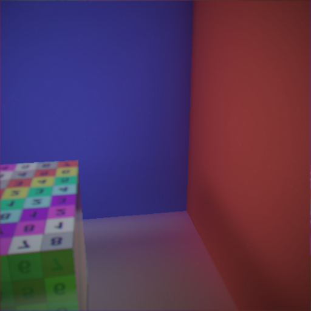
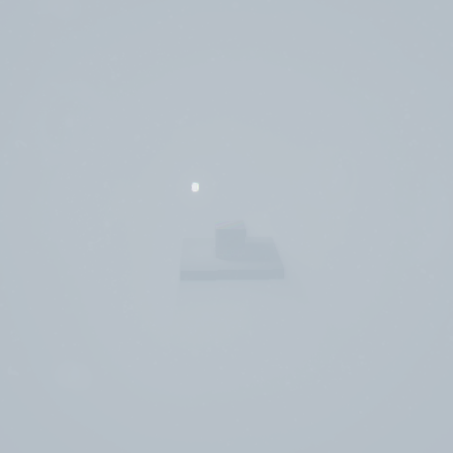

Mini Voxel Cone Tracing Engine
======================
* Ziyu Li
* Tested on: Windows 10, Intel i5-5257U @2.7GHz 8GB, Intel Iris Graphics 6100, OpenGL 4.4

## Features
#### All Features
 - Voxel Cone Tracing
	- Non-Conservative Voxelization with Atomic Counter
	- Reflection, Refraction, Emission
	- Soft Shadow
	- Ambient Occlusion
	- GI
- Post-Processing
	- Bloom
	- FXAA / SSAA
	- Lens Flare (Ghost and Halo)
	- Lens Dirt
	- Chromatic Aberration
	- Vignetting
	- Depth of Field
	- Light Scattering
	- Atmospheric Fog
	- HDR
	- Gamma Correction
	- Tone Mapping (Reinhard / Exposure / Filmic)
- In Progress
	- Auto-Focus
	- Bokeh
	- Environment Map
	- HBAO
- Future Plans...
	- Auto-Exposure
	- Conservative Voxelization
	- Anisotropic Mipmaps
	- ARBs

#### Voxel Cone Tracing
For performace result, All the images demonstrate below are not using any anti-aliasing.

##### Cornell Box (HDR 512x512, Voxels 64x64x64)

| Diffuse | Indirect Diffuse | Indirect Specular | Indirect and AO | Indirect, Shadow and AO | Only Indirect GI |
| ----- | ----- | ----- | ----- | ----- | ----- |
|  |  |  |  |  |   |

##### Cornel Box (HDR 512x512, Voxels 64x64x64, DOF, Bloom, Lens Effects)
| Scene 0 | Scene 1| Scene 2 |
| ----- | ----- | ----- |
|  |  |  |

##### Cornel Box GI (HDR 512x512, Voxels 64x64x64, DOF, Bloom, Lens Effects)
| Scene 0 | Scene 1 | Scene 2 |
| ----- | ----- | ----- |
|  |  |  |

##### Cornel Box with Tone Mapping (HDR 512x512, Voxels 64x64x64, DOF, Bloom, Lens Effects)
| Exposure | Filmic | Reinhard |
| ----- | ----- | ----- |
|  |  |  |

##### Cornel Box with Vignetting (HDR 512x512, Voxels 64x64x64, DOF, Bloom, Lens Effects)
| Normal | Vignetting with f8 | Vignetting with f22 |
| ----- | ----- | ----- |
|  |  |  |

##### Cornel Box with SSAA (HDR 512x512, Voxels 64x64x64, DOF, Bloom, Lens Effects)
| Normal | SSAA x2 | SSAA x4 (Extremely Slow!) |
| ----- | ----- | ----- |
|  |  |  |

##### Platform with Atmospheric Fog (HDR 512x512, Voxels 64x64x64, DOF, Bloom, Lens Effects, Atmospheric Effects)
| Far | Mid | Near |
| ----- | ----- | ----- |
|  |  |  |

##### Platform with Different Exposures (HDR 512x512, Voxels 64x64x64, DOF, Bloom, Lens Effects, Atmospheric Effects)
| 0.25 | 1.0 | 2.5 | 5.0 |
| ----- | ----- | ----- | ----- |
|  |  |  |  |

##### Platform with Other Effects (HDR 512x512, Voxels 64x64x64, DOF, Bloom, Lens Effects, Atmospheric Effects)
| Lens Flare and Dirt | DOF | Light Scattering |
| ----- | ----- | ----- |
|  |  |  |

#### Benchmarks
For performace result, All the images demonstrate below are not using any anti-aliasing.
All the benchmarks run on Intel Iris 6100 (OpenGL 4.4)

##### Test scenerio 

For a static-voxelization scene with all effects on (except AA),
the refresh rate is around 35-45fps which seems quite nice for a entry-level integrated graphics chip under resolution 512x512.
However, when the resolution jump to 1024x1024, the program barely runs under 15-20fps due to the low preformance.

Based on the diagnostics of the RenderDoc, textures read and write operations are the most intensed workload for post-effects.
For an integrated graphics chip which does not have the dedicate high bandwidth memory and poor texture fill rate could lead such bad results.
On the other hand, there is some optimization can be achieved in texture operations, such as blur.

Some other benchmark data will be uploaded soon.
In the future, using OpenGL vendor specific extensions could also utilize the full power of the lastest released graphics card.

(Unfinished......)

| Components   | Descriptions               | Runtime |
|--------------|----------------------------|---------|
| Framebuffer  | 512x512 4-channel HDR      |   n/a   |
| Cone Tracing | 8 Diffuse Cone             |   n/a   |
| Voxelization | 64x64x64 4-channel         |   n/a   |
| Bloom        | 256x256 UpRes              |   n/a   |
| Scatter      | 256x256 UpRes / 100 sample |   n/a   |
| DOF          | 3x3 sample                 |   n/a   |
| Others       | Flare 256x256              |   n/a   |

